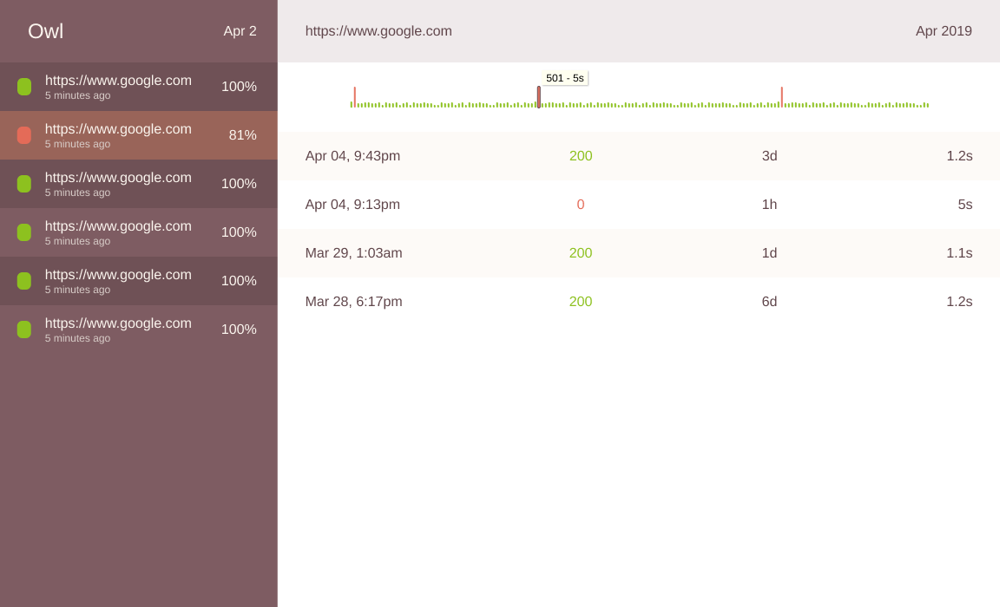

# Owl

> Owl is an open source self-hosted website monitor and status report dashboard.

## About

Owl comprises three packages:

1. A web API that handles all the data in and out of the database.
2. An agent that periodically checks your websites and report back to the API.
3. A client that consumes the API to to manage the data and display the status and history of tha agent's checks.

## Development

You'll need docker-compose 1.23+. Simply run:

```sh
$ docker-compose up
```

### Agent

The agent is a Go package designed to be invoked from a standalone Go program. The agent container will watch for source file changes and automatically run the test suite for the package.

### API

The API is a web service written in Go backed by an instance of PostgreSQL 10. The API container will watch for source file changes and automatically restart the server for you.

### Client

The client is a React application controlled by [create-react-app](https://github.com/facebook/create-react-app).

## Deploy

⚠️ Albeit the agent, the API, and the client share the same repository **they're deployed separately**. For heroku like environments you can use [git-subtree](https://github.com/apenwarr/git-subtree/blob/master/git-subtree.txt). e.g.

```shell
$ git subtree push --prefix api heroku master
```

The agent comes with a sub-package that runs on Amazon Lambda and has a `Makefile` with tasks to deploy and update your functions on the cloud.

## License

The MIT License © 2019 Corenzan
